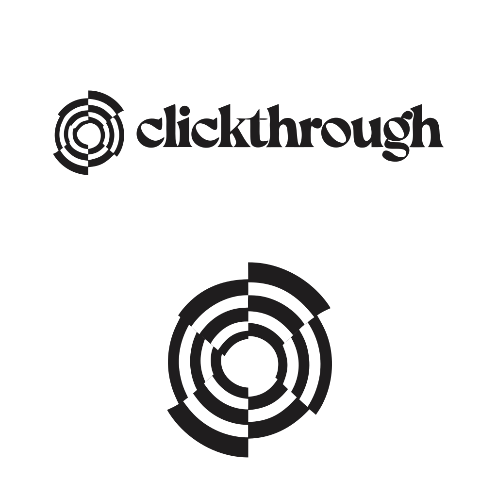

# Clickthrough

<p align="center">
  
</p>

**Any page. Any intent. The exact UI you need.**

Clickthrough is a runtime interface layer for the web. It observes the current browser context, understands what the user is trying to verify, understand, or do, then generates the exact overlay UI needed in that moment.

It is not a chatbot, sidebar, or separate assistant app.

Clickthrough changes the current page into the interface the user's intent needed.

## The Vision

Modern software makes people navigate.

Clickthrough lets them state intent.

Every website has too much interface: nested dashboards, hidden settings, confusing filters, overloaded pages, destructive workflows, and inconsistent controls. AI copilots usually sit beside the product and tell users what to click.

That is not enough.

The agent should not explain the maze. It should generate the missing door.

Clickthrough turns the browser into an intent-native operating layer:

```txt
Observe -> Understand intent -> Generate UI -> Ask approval -> Act -> Verify
```

## What Clickthrough Does

Clickthrough lives on top of the page the user is already using.

It can:

- inspect the visible page and DOM
- understand available actions and page context
- extract claims, selected text, forms, controls, and workflows
- search the web when the user needs verification
- generate task-specific overlay UIs at runtime
- adapt generated components to the host page's visual style
- ask approval before sensitive actions
- execute approved browser actions
- verify the result
- remember useful workflow preferences over time

The visible product is the generated UI itself.

## Demo Story

The hackathon demo is designed around four intent categories.

### 1. Verify

A teammate scrolls Twitter/X and sees:

> raulgcc1: "I'm excited to announce that I'm joining Amazon as a summer intern!"

They summon Clickthrough:

> Hey CT, is this true?

Clickthrough highlights the claim and generates a live evidence dashboard over the tweet: identity matching, source search, contradictions, confidence, and verdict.

### 2. Understand

A teammate is reading a dense OAuth 2.0 Authorization Code with PKCE paragraph in a PDF.

They ask:

> CT, explain this visually.

Clickthrough turns the static PDF into an interactive explainer with sequence diagrams, step controls, PKCE toggles, and callouts.

### 3. Act

A teammate is inside SharkAuth and needs a full-permissions API key.

They ask:

> CT, I need to create a new full-permissions API key.

Clickthrough generates a SharkAuth-native action panel with fields, scope matrix, risk summary, approval gate, execution log, and verified result.

### 4. Respond

A teammate sees a confusing social message and asks Clickthrough what it means and what to say.

Clickthrough generates a private explanation and response assistant directly where the user needs context.

Read the full storyboard in [`DEMO.md`](./DEMO.md).

## Generative UI Model

Clickthrough uses a controlled primitive system. The agent does not emit arbitrary HTML. It emits a structured UI tree:

```ts
type ClickthroughNode = {
  type: string;
  props?: Record<string, unknown>;
  children?: ClickthroughNode[];
};
```

The renderer validates the tree, maps primitives to real components, adapts styling to the host page, manages state, and routes approved actions to the browser layer.

Primitive categories include:

- overlay shell
- layout
- text and status
- inputs
- evidence and verification
- visual explanation
- action and approval
- safety and trust
- loading, error, and success states

See [`UI_PRIMITIVES.md`](./UI_PRIMITIVES.md) for the full primitive spec.

## Host-Native Overlays

Clickthrough has its own primitives, but generated UI should feel native to the current page.

Before rendering, the browser layer samples:

- font family
- color roles
- spacing density
- border radius
- input styles
- button styles
- borders and shadows
- light or dark mode

Then Clickthrough renders generated components that blend into the current surface while remaining recognizable as CT-controlled overlays.

Twitter/X gets an investigation surface.

The PDF reader gets a teaching surface.

SharkAuth gets an action surface.

The same intelligence, different generated UI.

## Hackathon Stack

The Generative UI Global Hackathon names **A2UI**, **AG-UI**, **MCP Apps**, and **CopilotKit** starter kits/protocols.

Clickthrough's planned stack:

- **Vite + React + TypeScript** for the browser overlay prototype.
- **AG-UI** for streaming agent state and progressive UI generation.
- **Clickthrough primitive schema** for the runtime UI tree.
- **Clickthrough agent loop** for model-agnostic planning, tool routing, approval, execution, and verification.
- **Harness policies** inspired by strong agent-loop systems: budgeted turns, typed tools, permissions, hooks, compaction, streaming, and verification.
- **Deep DOM scanner** for page understanding, capability mapping, host style sampling, and action targeting.
- **Full backend** for agent orchestration, web search, tool calls, schema validation, action planning, verification, and memory.
- **MCP Apps** for tool/app discovery and external capabilities where useful.
- **CopilotKit** if it accelerates hotkey prompt, agent state wiring, action callbacks, or human approval flow.
- **A2UI** as a schema/protocol influence if it helps quickly.

The product must never collapse into a chat interface. These tools serve the generated overlay experience.

See [`STACK.md`](./STACK.md) for the current stack decision.

## Repository Guide

- [`HANDBOOK.md`](./HANDBOOK.md): hackathon rules and judging frame.
- [`DEMO.md`](./DEMO.md): recorded demo script and storyboard.
- [`STACK.md`](./STACK.md): chosen prototype stack and boundaries.
- [`ARCHITECTURE.md`](./ARCHITECTURE.md): ASCII system architecture and ownership map.
- [`AGENT_LOOP.md`](./AGENT_LOOP.md): model-agnostic agent harness and state machine.
- [`HARNESS.md`](./HARNESS.md): browser-agent harness spec for tools, memory, approval, UI validation, and verification.
- [`UI_PRIMITIVES.md`](./UI_PRIMITIVES.md): primitive schema and component requirements.
- [`OPEN_DESIGN_PROMPT.md`](./OPEN_DESIGN_PROMPT.md): prompt for generating visual primitives in Open Design.
- [`AGENTS.md`](./AGENTS.md): working notes for AI agents and team members.

## One-Sentence Pitch

Clickthrough is a browser agent that generates runtime overlay interfaces for whatever the user is trying to verify, understand, or do on the current page.

## Final Framing

> Chatbots explain the maze.
>
> Clickthrough generates the door.
